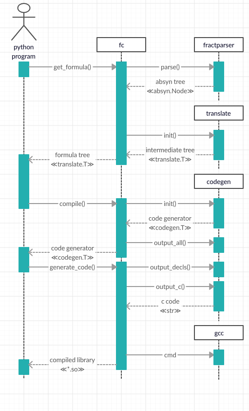
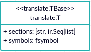
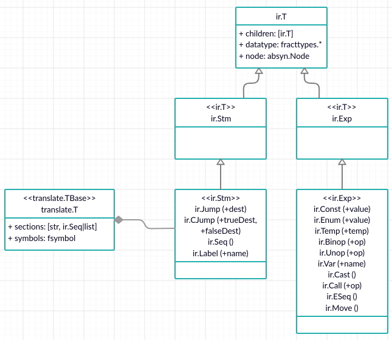

# Developer's guide

Gnofract 4D is a program which draws complex mathematical objects known as fractals, including the Mandelbrot and Julia sets and many others. It allows you to treat a fractal which has more than one parameter as a four-dimensional object and interactively view slices of this object from arbitrary angles, giving rise to some very unusual images.

## Table of contents

- Fractal geometry
- Calculating a point
- Algorithms
  - Fractal drawing strategy
  - Auto-deepen and auto-tolerance
  - Antialiasing
  - Compilation
- Data structures
  - The image metadata
  - Syntax tree
  - Formula translate
  - Symbol table
  - Instructions and sections
- How to contribute
  - Installation using Docker
  - Testing
  - Linting
  - Generating documentation
- FAQ

## Fractal geometry

Gnofract 4D ​_allows you to treat a fractal as a four-dimensional object and interactively view slices of this object from arbitrary angles_.​ This phrase, from the [manual](https://fract4d.github.io/gnofract4d/manual/index.html), is hard to understand unless you are deep into the maths behind it.

To determine which slice to draw you need to give Gnofract 4D some parameters. You need to open the `fractal settings` pane from the `edit` menu; once there just navigate to the `location` tab. There you'll find the parameters `x`, `y`, `z` and `w` which correspond to the center point of the fractal in the 4D space, the `size`, that turns to be the zoom, and the plane rotations of the combination of the 4 axis `xy`, `xz`, `xw`, `yz`, `yw` and `zw`.

The result we are expecting from Gnofract 4D is a 2D image. That image is nothing but a grid of pixels, so we just need Gnofract 4D to give a color to each one.

Consider this abstract of the Mandelbrot Set ​(z​<sub>n+1</sub>​ = z​<sub>n</sub><sup>2</sup>​ + c) w​ritten in the formula language that uses Gnofract 4D:

```
init:
    z = #zwpixel
loop:
    z = sqr(z) + #pixel
```

This is a piece of the recipe to build that 4D object we were talking about. Symbols prefixed with # are special values for the formula language. If we believe that every pixel corresponds to a given point into the 4D space, then every pixel location could be expressed as a 4D coordinate `x`, `y`, `z`, `w`. In this case `#zwpixel` corresponds to the `z` and `w` values of the pixel while `#pixel` corresponds with `x` and `y`.

Note that `#zwpixel` and `#pixel` have two components each, and thus, operations (like addition) over them are treated as complex number operations.

For Gnofract 4D to assign every pixel a 4D coordinate it needs to calculate the _scaled rotation matrix_. That is a 4x4 matrix resulting from multiplying every rotation matrix for the 6 plane rotation input parameters, multiplied by the identity matrix by the size parameter.

When calculating the rotation matrix what we are doing is calculating a projection into the different axis and, considering we want to print a 2D slice, we need to know how it projects to the `x` and `y` axis. Then, since the image we are drawing is represented in pixels, we need to know the projection of every its pixels. To calculate that, Gnofract 4D divides the rotation matrix by the width in pixels (this applies either for the `x` and for the `y` projections to preserve the aspect ratio) then `x` and `y` projections from that matrix are taken as `deltax` and `deltay` values (distance between pixels). So far so good, as we already have the center point (input parameters `x`, `y`, `z`, `w`) we can calculate the rest by moving from the center. The top-left pixel would be `center - deltax * width / 2.0 - deltay * height / 2.0` meaning _half the width to the left and half the height to the top from the center_. If that is pixel (0,0), you can imagine that calculating pixel (10,20) would be as easy as `topleft + 10*deltax + 20*deltay`.

So now we have given every pixel a value in the 4D space (`x`, `y`, `z`, `w`) as a projection in 2D.

## Calculating a point

As mentioned before in the _fractal geometry_ section, Gnofract 4D draws slices of 4D objects, that is 2D images. Those images are built as a set of pixels and every pixel is given a color individually given its position in the 4D space, and _the recipe_ to build the object sliced in that space.

The _recipe_, or the formula, is written in the formula language supported by Gnofract 4D and then compiled into C language. The formula language is quite powerful; it provides useful symbols, functions, control structures and so on that allow the user to build infinite kinds of fractals.

When [writing a formula](http://fract4d.github.io/gnofract4d/manual/index.html#writing-your-first-formula​) you need to know there is a basic structure that composes the strategy to calculate every pixel color. In its most basic form, that structure is composed in three sections:

- `init`: set the initial value.
- `loop`: calculate the iteration value based on the previous iteration result (or the initial value for the first iteration).
- `bailout`: check if the iteration value meets some condition.

This strategy might sound arbitrary but it is the foundation method for calculating fractals that Gnofract 4D lies on: **​the iterated function system**​.

An iterated function system it's just a method to produce a series of values (that is the reason they are also called dynamic sequences), in which every value is the result of the function, taking the previous value in the sequence as the input. I recommend to watch [this series of videos](​https://www.youtube.com/watch?v=ZSS-Adr5Gcc) to understand it.

In the formula sections described before, the `bailout` is meant to determine whether the sequence is bounded or not. That is the primary result we get for every pixel: _is the value associated with this pixel bounded or not_.

The amount of iterations taken to determine that condition is what makes the fractal look funny.

If you look at the `fractal settings` pane (you can make that visible from the `edit` menu), you will see there is a `formula` tab, in which you are going to write your _iterated function_. There is a couple of extra tabs, called `outer` and `inner` where you can also write scripts using the formula language. Those scripts are also _compiled_ into C along with the formula script. They are meant to calculate the color from the output of the main formula script. The basic idea is to get a color from a set of colors (probably a gradient) based on the number of iterations to determine whether the sequence was bounder (here we would use _inner_ script) or not (_outer_ script).

## Algorithms

### Fractal drawing strategy

The fractal drawing process is done in different steps/passes.

In the first pass we draw tiles of 16x16. For every tile we calculate only one pixel's color but we assign the whole tile (256 pixels) that same color. The metadata (iterations, fate and index) we only assign it to the corresponding pixel.

Tiles are processed left to right, filling the remaining row space (whenever the width of the image is not multiple of 16) line by line and pixel by pixel, and the remaining bottom space (whenever the height of the image is not multiple of 16) in the same way.

In the second pass, those tiles (or boxes, which is the name you will find in the sources) are processed left to right and top to bottom each at a time in the following way:

1. Calculate every pixel at the edges:
    1. If all the pixels at the edges are the same color then we just fill the box (assigning the metadata to all pixels).
    2. Otherwise:
        1. If the box width is greater than 4 pixels the we divide the box in 4 boxes and start from step 1 for every sub-box.
        2. Otherwise we calculate every pixel inside the box individually (not the edges because we already did).

For this second phase, in the process of checking if the pixels at the edges are the same, we consider the color and the iterations.

When dividing the boxes into sub-boxes, some of the edges of these new boxes are already calculated. Avoiding re-calculate those edge pixels is granted at a pixel level, because when a pixel is calculated its fate is stored in a buffer and checked afterwards to prevent re-calculate it.

### Auto-deepen and auto-tolerance

When calculating a single point we use a technique to detect periodic values in the iteration output series (having z<sub>​n+1</sub> = z<sub>n</sub><sup>​2</sup> + c for example, which is the Mandelbrot Set, we look for series of values of `z` that oscillate between a certain max and min values). This is done at a formula
level using a [well-known algorithm](https://en.wikipedia.org/wiki/Cycle_detection#Brent's_algorithm​).

The later cycle detection algorithm compares values at certain n-iterations to detect such periodic series. In Gnofract 4D we use a threshold value within which we consider two iteration output values equal, the so-called period tolerance.

Usually we consider a point within a set (trapped) if we reach the max iterations without reaching the bailout condition or if we find a periodic series of values.

This is one way to limit the number of iterations performed for each point. Gnofract 4D provides some other optimizations to cut processing costs:

- period-guess: adjust the n-iteration to start checking for periods.
- auto-tolerance: adjust the tolerance value to consider two values equal when checking for periods.
- auto-deepen: adjust the max iterations needed to calculate each point.

First one is called _period guess_ and its implementation is quite simple: if the last point was trapped (inside the set), the next point we start from 0, otherwise we start from the same iteration of the last point plus 10 (obviuosly until we get to max-iters... meaning we will not check for periods). If you look at a Mandelbrot Set image this makes sense because trapped values are usually within continuous areas (cardioids). It also makes sense because period-checking has a computational cost we do not always want.

Auto-deepen and auto-tolerance are user-configurable in Gnofract 4D preferences panel. These two optimizations are performed at a higher abstraction level (the whole image), using calculation statistics. This is how it works (how and what statistics are collected and processed) in order to change those values:

When it comes to drawing the fractal image, a number of parameters are used to build a specific slide (in case we are working with 4D objects). That slide is drawn pixel by pixel (well, actually there is a more sophisticated strategy based on tiles that allows to split work in different threads and skip some pixels to be calculated).

During this process of drawing the pixels, some statistics are collected:

- Total iterations (overall).
- Total pixels calculated.
- Total pixels inside the set.
- Total pixels inside the set detected with period checking.
- Total pixels outside the set.

Then there are also some statistics collected only with a given frequency because of the cost:

- Auto-tolerance stats:
    - If the pixel was inside we calculate the same pixel but with `tolerance / 10`. If now the pixel is outside we mark this as _the tolerance is too high_.
    - If the pixel was outside we calculate the same pixel but with `tolerance * 10`. If now the pixel is inside we mark this as _we cannot decrease the tolerance_.
- Auto-deepen stats:
    - If the iters taken were greater than the half of the max iters we mark it as _we cannot decrease the max iters_.
    - Otherwise, if the pixel was inside we calculate the same pixel but with `maxiters * 2`. If now the pixel is outside (did not reach the maxiters) we mark this as _we need to increase the iters_.

Then statistics are processed in this way:

- Auto-tolerance stats:
    - If more of the 0.1% of the samples are marked as _the tolerance is too high_ then we divide the tolerance by 10 (making the threshold smaller).
    - Otherwise, if there is no samples marked as _the tolerance is too high_ and the sampling ratio marked as _we cannot decrease the tolerance_ does not exceed 0.5% we increase the tolerance. The maximum tolerance is hardcoded as 1.0E-4.
- Auto-deepen stats:
    - If more of the 1.0% of the samples are marked as _we need to increase the iters_ then we double the max iters.
    - Otherwise, if there is no samples marked as _we need to increase the iters_ and the sampling ratio marked as _we cannot decrease the max iters_ is less than 0.5% we divide the maxiters by 2. The minimum value for maxiters is hardcoded to 32.

If any of the previous conditions is met, meaning we have to change tolerance or maxiters, the calculation process is repeated in whole until no condition is met again. This means that for images with very high entropy the calculation process could it be repeated multiple times until getting the final image.

You may wonder: if you already draw the image... Why update iters and tolerance? The answer is: you have not finished with the image yet, you still have to apply the post processing algorithms (antialiasing) which may need 4x times the same amount of calculations of the original image. But also those new values could be used by the user interface to be prepared for the next user request (zooming the image).

What we have found so far is that this mechanism of registering and processing the statistics is not working properly: it is non-deterministic. As you zoom in and out and image you can see, depending on how high is the entropy in the zoomed area, how tolerance and maxiters change (you need to have those optimizations enabled in the preferences panel). However, in most cases, it tends to a fixed value and then, no matter you zoom in or out the do not change anymore.

### Antialiasing

Some of the images generated by Gnofract 4D could present the problem of the _moire effect_. Gnofract 4D comes with a solution for that problem: antialiasing.

After performing the calculations for the regular image, that is done in multiple passes and gathering some metadata and statistics information, as explained before, a last optional (if antialiasing is activated through user preferences) pass is performed row by row and pixel by pixel within that row, as follows:

- If the _fast antialias_ is selected by the user, nearby pixels (top, bottom, right and left ones) are checked if they have the same index and iterations as the pixel being antialiased. In that case, the sub-pixels (there are four subpixels per pixel) are assigned those same properties.
- Otherwise (_best antialiasing_ selected or the condition checked is not met) every sub-pixel is calculated individually, and the whole pixel is assigned the average color of the four subpixels.

This technique is called [_supersampling_](​https://en.wikipedia.org/wiki/Supersampling​), and the _uniform distribution_ pattern is the one used.

To understand how this really works, we must know that every pixel is not a discrete point but an area within the 4D space. In the _geometry_ section we calculated a delta value, which is the distance between two pixels, or better said: between the center point of two pixel areas.

So what we do is: we divide that pixel into four areas (the four sub-pixels) and we calculate that sub-pixel taking its center point, then we calculate the average color and assign it to the whole pixel area.

### Compilation

The compilation process could be splitted in these main phases:

1. **Analysis​**: the main objective in this phase is get the formula parsed. Usually this part of
the compiler is known as _front-end_, and it will take an input formula file, parse it and generate an intermediate representation of the code. The main modules involved in this phase are:
    - `fc`​: the main Gnofract 4D compiler module and it will receive the commands from the python program (script or GUI), open the formula file and orchestrate the compilation.
    - `preprocessor`:​ detects splitted lines, compressed lines and extra white spaces.
    - `fractparser`​: this is the module that will manage the parsing of the file and its formulas, and generate the abstract syntactic tree. The submodules used for the parser are:
        - `fractlexer`:​ it contains the parser tokens and reserved words of the formula language, and matcher methods to detect them in the file.
        - `yacc`​ and `l​ex`:​ these are the [PLY](​https://github.com/dabeaz/ply​) yacc and lex files used to process the file from a defined token list, precedences and grammar rules.
        - `absyn​`: include the definition of the abstract syntactic tree.
    - `translate`:​ this module takes the abstract syntactic tree and constructs an intermediate representation of the code and a symbol table. There are different kinds of translate trees depending which of the supported formula formats is being used (see _Formula translate_ in the _Data structures_ section for more information).
        - `ir​`: the definition of the intermediate representation nodes is found in this module.
        - `fsybmol`​: this module implements the symbol table.
2. **Synthesis**​: the main objective of this phase is to generate a library with the formula compiled. This part of the compiler receives the name of _back-end_, and it will take the intermediate representation of the code generated in the analysis, generate a C program, compile it, and create the shared library used for the Gnofract 4D C extension. The main modules in this phase are:
    - `fc`​: it takes the translate structure that includes the intermediate representation and the symbol table generated before, and its responsibility is to orchestrate the C code generation and the final compilation.
    - `codegen`:​ this module completes the sections and the symbol table with every temporally variable needed for the instructions. After that execute an optimization process. The other main task of the module is generate the C code using these structures and predefined templates of the final C program.
        - `instructions​`: types for _assembler_ instructions.
        - `optimize`: ​it contains the optimization rules and methods to be used for the code generator.
        - `gcc`: this is the GNU C/C++ module that is used to compile the C program and generate the shared library generation.

The module ​fracttypes​ is used in both phases and it includes the compiler types. This is a basic example of the flow of the compiler:



In the following example the python client uses the fractal compiler `​compile_all()​` method to add not only the fractal formula itself but the colouring formulas for the inner and the outer regions of the fractal.


## Data structures

### The image metadata

The fractal image representation is hold in memory through these buffers:

- `color`: the actual RGBA color of the pixel.
- `iters`: the iters took to calculate the pixel.
- `fate`: either if the point (the complex value) scapes or not from the fractal set.
- `index`: the point in the gradient to get the color from.

All these properties can also be used in the [formula language](http://fract4d.github.io/gnofract4d/manual/index.html#formula-language-reference) as symbols.

`index` and `fate` properties are stored at a subpixel level, so for every pixel we have four indexes and four fates. This is because of the antialiasing technique.

### Syntax tree

When a formula file is parsed in the compiler an abstract syntax tree is constructed during the process.

**Mandelbrot formula in Ultra Fractal language**

```
Mandelbrot {
; The classic Mandelbrot set
init:
    z = #zwpixel
loop:
    z = sqr(z) + #pixel
bailout:
    @bailfunc(z) < @bailout
default:
float param bailout
    default = 4.0
endparam
float func bailfunc
    default = cmag
endfunc
}
```

**Abstract syntax tree dump via absyn.Node.pretty()**

```
[formula : Mandelbrot
 [stmlist : nameless]
 [stmlist : init
  [assign : None
   [id : z]
   [id : #zwpixel]
  ]
 ]
 [stmlist : loop
  [assign : None
   [id : z]
   [binop : +
    [funcall : sqr
     [id : z]
    ]
    [id : #pixel]
   ]
  ]
 ]
 [stmlist : bailout
  [binop : <
   [funcall : @bailfunc
    [id : z]
   ]
   [id : @bailout]
  ]
 ]
 [setlist : default
  [param : bailout(float)
   [set : None
    [id : default]
    [const : 4.0(float) ]
   ]
  ]
  [func : bailfunc(float)
   [set : None
    [id : default]
    [id : cmag]
   ]
  ]
 ]
]
```

This tree will be used in the following steps of the compiler to create an intermediate representation of the formula. The classes needed for this structure and its management is in the [absyn module](​https://github.com/fract4d/gnofract4d/blob/master/fract4d_compiler/absyn.py)​.

### Formula translate

This structure is created from the abstract syntax tree and it includes the symbol table and the formula sections. These sections are a list of every formula section in an intermediate representation.



The formula tree could be an instance of these different subtypes:

- `T`: used for the UltraFractal formulas.
- `Transform`: used when a UltraFractal transforms file (*.uxf) has been parsed. The formulas contained in these files are used to apply transformation to the result from the primary fractal formula.
- `ParFile`: used when a FractInt parameters file (*.par) has been parsed. These files include the options used to the actual fractal, similar to the `<default>` block in the UltraFractal formula and the GTK parameter inputs.
- `GradientFunc`: used when a UltraFractal gradients file (*.ugr) has been parsed. These files contain gradients that store coloring information for a fractal.
- `ColorFunc`: used when a UltraFractal coloring formulas file (*.ucl) has been parsed. These files contain multiple coloring algorithms.

These subtypes share the same interface but different sections and symbols are created [when the formula is compiled](https://github.com/fract4d/gnofract4d/blob/master/fract4d_compiler/translate.py).

### Symbol table

Usual symbol table used in compilation process. The table is created when the formula translate tree is created after the formula is parsed, and it is completed during the compilation phase.

For example the Mandelbrot formula in UltraFractal language generate, during the creation of the formula tree - T subtype, a symbol table as follow:

**Mandelbrot formula in UltraFractal language**

```
Mandelbrot {
; The classic Mandelbrot set
init:
    z = #zwpixel
loop:
    z = sqr(z) + #pixel
bailout:
    @bailfunc(z) < @bailout
default:
float param bailout
    default = 4.0
endparam
float func bailfunc
    default = cmag
endfunc
}
```

**Symbol table after formula is parsed**

```
| "t__a_bailout"   | "float 0.0 (29)"
| "t__a__gradient" | "grad 0 (-1)"
| "+"              | "[<fract4d_compiler.function.Func object at 0x7f9dfd318240>, <fract4d_compiler.function.Func object at 0x7f9dfd31ce80>, <fract4d_compiler.function.Func object at 0x7f9dfd31ce10>, <fract4d_compiler.function.Func object at 0x7f9dfd2a0ef0>, <fract4d_compiler.function.Func object at 0x7f9dfd2a0b38>]"
| "sqr"            | "[<fract4d_compiler.function.Func object at 0x7f9dfd30ac18>, <fract4d_compiler.function.Func object at 0x7f9dfd30a860>, <fract4d_compiler.function.Func object at 0x7f9dfd30c748>, <fract4d_compiler.function.Func object at 0x7f9dfd315fd0>]"
| "z"              | "complex [0.0, 0.0] (-1)"
| "t__h_zwpixel"   | "complex [0.0, 0.0] (-1)"
| "pixel"          | "complex [0.0, 0.0] (-1)"
| "__bailout"      | "bool 0 (-1)"
| "t__a_bailfunc"  | "[<fract4d_compiler.function.Func object at 0x7f9dfd2ee240>]"
| "cmag"           | "[<fract4d_compiler.function.Func object at 0x7f9dfd2f6a90>, <fract4d_compiler.function.Func object at 0x7f9dfd2f6b00>]"
| "<"              | "[<fract4d_compiler.function.Func object at 0x7f9dfd2b4dd8>, <fract4d_compiler.function.Func object at 0x7f9dfd2b4358>, <fract4d_compiler.function.Func object at 0x7f9dfd2d9f60"
```

**Symbol table after formula is compiled**

```
| "t__a_bailout"   | "float 0.0 (29)"
| "sqr"            | "[<fract4d_compiler.function.Func object at 0x7f9dfd30ac18>, <fract4d_compiler.function.Func object at 0x7f9dfd30a860>, <fract4d_compiler.function.Func object at 0x7f9dfd30c748>, <fract4d_compiler.function.Func object at 0x7f9dfd315fd0>]"
| "z"              | "complex [0.0, 0.0] (-1)"
| "pixel"          | "complex [0.0, 0.0] (-1)"
| "t__f10"         | "bool 0 (-1)"
| "t__f7"          | "float 0.0 (-1)"
| "t__f5"          | "float 0.0 (-1)"
| "t__f2"          | "float 0.0 (-1)"
| "t__a_bailfunc"  | "[<fract4d_compiler.function.Func object at 0x7f9dfd2ee240>]"
| "t__f1"          | "float 0.0 (-1)"
| "t__a__gradient" | "grad 0 (-1)"
| "+"              | "[<fract4d_compiler.function.Func object at 0x7f9dfd318240>, <fract4d_compiler.function.Func object at 0x7f9dfd31ce80>, <fract4d_compiler.function.Func object at 0x7f9dfd31ce10>, <fract4d_compiler.function.Func object at 0x7f9dfd2a0ef0>, <fract4d_compiler.function.Func object at 0x7f9dfd2a0b38>]"
| "t__f4"          | "float 0.0 (-1)"
| "t__f6"          | "float 0.0 (-1)"
| "t__f3"          | "float 0.0 (-1)"
| "t__f0"          | "float 0.0 (-1)"
| "t__f8"          | "float 0.0 (-1)"
| "t__f9"          | "float 0.0 (-1)"
| "<"              | "[<fract4d_compiler.function.Func object at 0x7f9dfd2b4dd8>, <fract4d_compiler.function.Func object at 0x7f9dfd2b4358>, <fract4d_compiler.function.Func object at 0x7f9dfd2d9f60>]"
| "t__h_zwpixel"   | "complex [0.0, 0.0] (-1)"
| "__bailout"      | "bool 0 (-1)"
| "cmag"           | "[<fract4d_compiler.function.Func object at 0x7f9dfd2f6a90>, <fract4d_compiler.function.Func object at 0x7f9dfd2f6b00>]"
```

After this phase, the symbol table contains all the symbols needed for the code generation.

### Instructions and sections

Along with the symbol table the sections are the other important part of the formula translate tree. The sections are a dictionary of sections, and every section is a pair of section names and an instruction tree `<ir.T>`.



Every instruction tree starts with a `Seq` node as root, then it has an expression `Move` within all the instruction expressions found in the code. Finally `Seq` nodes are replaced by a ternary of expression nodes: `Label`, `Move` and `Jump`. The set of instructions of the formula section is stored in its tree section under the `Move` node.

**Mandelbrot formula in Ultra Fractal language**

```
Mandelbrot {
; The classic Mandelbrot set
init:
    z = #zwpixel
loop:
    z = sqr(z) + #pixel
bailout:
    @bailfunc(z) < @bailout
default:
float param bailout
    default = 4.0
endparam
float func bailfunc
    default = cmag
endfunc
}
```

**Abstract syntax tree dumped via absyn.Node.pretty()**

```
- section: "init"
Label(t__start_finit)
Move(
 Var<complex>(z)
 Var<complex>(#zwpixel)
)
Jump(t__end_finit)

- section: "loop"
Label(t__start_floop)
Move(
 Var<complex>(z)
 Binop(+
  Call(sqr
   Var<complex>(z)
  )
  Var<complex>(#pixel)
 )
)
Jump(t__end_floop)

- section: "default"
Label(t__start_fdefault)
Move(
 Var<float>(@bailout)
 Const(4.0)
)
Jump(t__end_fdefault)

- section: "bailout"
Label(t__start_fbailout)
Move(
 Var<bool>(__bailout)
 Binop(<
  Call(@bailfunc
   Var<complex>(z)
  )
  Var<float>(@bailout)
 )
)
Jump(t__end_fbailout)
```

## How to contribute

Like any other open source project, help is welcome! You can contribute sending your PRs or creating new [issues](https://github.com/fract4d/gnofract4d/issues) in case you find some bug.

In fact, there are [some interesting issues](https://github.com/fract4d/gnofract4d/issues?q=is%3Aissue+is%3Aopen+label%3A%22help+wanted%22) you can check if you are willing to help.

### Installation using Docker

The repository comes with a docker environment ready to start working with Gnofract 4D. All you have to do once you have cloned the repository is to run:

```
docker-compose up
```

This will generate the docker images needed to run the application and will launch it.

### Testing

Testing requires pytest for Python 3. In some distributions, `pytest` is for Python 2. You can get latest version with:

```
pip3 install pytest
```

Run individual tests from the top-level directory using `pytest`, e.g.:

```
pytest fract4d/test_absyn.py
```

Optionally, install `tox` and test with all supported Python versions by running:

```
tox
```

On macOS you might find an error regarding the number of opened files, you can increase the system limit with `ulimit -Sn 10000`.

### Linting

`pylint` is being used to detect code that does not follow the [PEP8 style](https://www.python.org/dev/peps/pep-0008/) guide and potentially erroneous code in Python. You can run it in two ways:

Directly (firstly you should install pylint through `pip3`):

```
$ pip3 install pylint
$ ./bin/pylint.sh
```

Or using docker (same environment as pipeline):

```
$ ./docker/bin/run_lint.sh
```

### Generating documentation

You can only regenerate the docs if you clone the Gnofract 4D git repo - the source dist packages contain the generated docs but not the input files for the generation process. To regenerate the docs:

1. Make sure you're starting from a git clone not a source .zip - you need the files under manual/content.
2. The documentation theme is managed in a separate repository and embedded in manual/themes/book as a submodule. Initialize and update it with `git submodule update --init`.
3. Install hugo:
    * Ubuntu 18.04 has an older version. Run `snap install hugo --channel=extended` instead of `apt install hugo`.
    * For macOS you can install with `brew install hugo`.
4. Run `./createdocs.py`.

## FAQ

**When I try to compile Gnofract 4D why do I get this error?**

```
Traceback (most recent call last):
  File "./setup.py", line 4, in ?
    from distutils.core import setup, Extension
ImportError: No module named distutils.core
```

Python-devel is not installed. I have seen this on SuSE, where they split the distutils module into a separate python-devel package which is not installed by default. Personally I think that is a really bad idea, but _c'est la vie_. To compile Gnofract 4D successfully on SuSE linux, you must have these packages installed beyond the defaults:

- python-devel
- gtk2-devel
- gconf2-devel
- libpng-devel
- libjpeg-devel
- gcc
- gcc-c++

Install those using YaST then try compiling again.

**When I try to compile older versions of Gnofract 4D on Ubuntu, why do I get this error?**

```
Can't set up. Error running 'pkg-config gconf-2.0 --cflags'.
Package gconf-2.0 was not found in the pkg-config search path.
Perhaps you should add the directory containing `gconf-2.0.pc'
to the PKG_CONFIG_PATH environment variable
No package 'gconf-2.0' found
Possibly you don't have one of these installed: 'gconf-2.0'.
 ```

`libgconf2-dev` is not installed. You need to install the `libgconf2-dev` package, which is required to build programs which use `gconf`. Newer versions will still compile if you do not have `gconf2-devel`, but they will be unable to pick up your browser settings from `gconf`.

**When I try to compile Gnofract 4D, why do I get this error?**

```
cc: error trying to exec 'cc1plus': execvp: No such file or directory
error: command 'gcc' failed with exit status 1
 ```

You have the C compiler installed, but not the C++ compiler. You need to install the g++ (sometimes called `gcc-c++`) package, which is required to build C++ programs.

**When I run setup.py, how come I get messages about 'NO JPEG HEADERS FOUND'?**

Jpeg headers are not installed. Gnofract 4D contains some optional functionality - the compiled version always contains it, but if you compile it yourself, Gnofract 4D will try to detect the things it needs to build that optional functionality. If it cannot find it, Gnofract 4D will still compile and work (though some unit tests will fail) but won't contain that ability. To fix this, you need to install the right libraries and headers.

The relevant pieces are:

1. PNG headers. The package containing these is usually `libpng-devel`, or `libpng12-dev`. If you do not have this you cannot save to PNG files.
2. JPEG headers. The package containing these is usually `libjpeg-devel` or `libjpeg62-dev`. If you do not have this you cannot sane to JPEG files.

**When I run setup.py, it fails with this message (and lots more). What's up?**

```
fract4d/c/fract4dmodule.cpp:14:20: error: Python.h: No such file or directory
```

You do not have the headers for Python installed. They are usually in a package called `python-dev` or similar.

**I installed the Jpeg/PNG headers, but setup.py still complains it cannot find them. What gives?**

This is a known issue with Ubuntu and its derivatives version 11.10 and higher. You are missing the package `pkg-config`. If you are missing this then you may also be missing `build-essential` which is Canonical's recommended way to install the basic development tools for Ubuntu.
