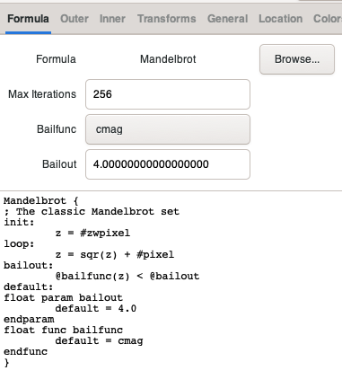
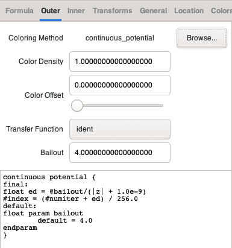
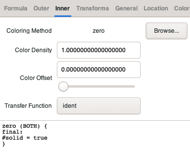

# EXAMPLES

*Note: for all exmples make sure you have performed the setup previously:*
```
./setup.py build
```

## Python examples
### Creating a simple mandelbrot using fract4dc.controller

Execute:
```
examples/python/simple_mandelbrot.py
```
Then you should see a new file under `examples/output`.

---

## C++ examples
For these examples you'll need [docker](https://docs.docker.com/get-docker/)

### Creating a simple mandelbrot
Execute:
```
examples/cpp/simple_mandelbrot.sh
```
Then you should see a new file under `examples/output`.


### Creating a simple mandelbrot using multiple threads
Execute:
```
examples/cpp/multithread_mandelbrot.sh
```
Then you should see a new file under `examples/output`.


### Creating a simple mandelbrot using no high level model entities (fractfunc, workers, pointfunc)
In this example we use the compiled formula directly to calculate the fractal with no postprocessing (antialiasing) or improvements (ie. autodeepen)
Execute:
```
examples/cpp/raw_mandelbrot.sh
```
Then you should see a new file under `examples/output`.


### Creating a simple mandelbrot using no high level model entities (fractfunc, workers, pointfunc)
### plus: using a custom formula source (not generated by compiler)

In this example we use the compiled formula directly to calculate the fractal with no postprocessing (antialiasing) or improvements (ie. autodeepen)

The forumula sources `examples/cpp/custom_mandelbrot_formula.c` were generated using gnofract4d and then modified introducing comments and eliminating some temporary vars to clarify calculations

These are the formulas used to generate the sources to begin with:

* main formula: __The Mandelbrot set__
```
Mandelbrot {
; The classic Mandelbrot set
init:
	z = #zwpixel
loop:
	z = sqr(z) + #pixel
bailout:
	@bailfunc(z) < @bailout
default:
float param bailout
	default = 4.0
endparam
float func bailfunc
	default = cmag
endfunc
}
```
* outer transfer function: __Continuous Potential__
```
continuous_potential {
final:
    float ed = @bailout/(|z| + 1.0e-9)
    #index = (#numiter + ed) / 256.0
default:
float param bailout
	default = 4.0
endparam
}
```
* inner transfer function: __Zero__
```
zero (BOTH) {
final:
     #solid = true
}
```
Each of these formulas has its own params, you cam see them on the GUI (fractal settings):





Except for the functions (bailfunc in the Formula and transfer functions in Inner and Outer) all the param values are passed to the formula through the init function.
> Have in mind the formula sources are written in C. This is how you pass the params to the formula: `pf_handle->vtbl->init(pf_handle, const_cast<double *>(pos_params), params.get(), param_len);`

> Actually there's no reason but to keep the interface to send the `pos_param`(x,y,z,w ...) in the init call. The formula params are kept in the state of the pf_handle and used afterwards in the calc method.

> If you look at the code that the compiler spits out there's some parts that seem to have been left behind and are no longer needed: `get_defaults` interface and almost all the state props in `pf_real`struct.

> bailfunc and transfer functions (with values cmag, ident and ident respectively) are not passed along with the params but instead they are coded by the compiler.

If you compare `examples/cpp/custom_mandelbrot_formula.c` with the code generated by running `./gnofract4d --nogui --buildonly mandelbrot -f gf4d.frm#Mandelbrot` you'll find the temporary variables and unused code we disposed for this example to make the code easy to understand.

Back to the Mandelbrot Set formula you can see in the screenshots above or in the file `formulas/gf4d.frm`. There you can identify sections (ended with a colon) init,
loop, bailout... In the source you'll find those sections wrapped by goto labels and some comments we introduced for this example:
* init:
```C++
t__start_finit:;
    // init: z = #zwpixel
    z_re = t__h_zwpixel_re;
    z_im = t__h_zwpixel_im;
    goto t__end_finit;
t__end_finit:;
```
* loop:
```C++
t__start_floop:;
    // loop: (z = sqr(z) + #pixel) same as (z = z*z + #pixel)
    // complex x complex -> (a+bi)⋅(c+di)=(ac−bd)+(ad+bc)i
    t__f5 = (z_re * z_re - z_im * z_im) + pixel_re;
    t__f6 = (2.00000000000000000 * z_re * z_im) + pixel_im;
    z_re = t__f5;
    z_im = t__f6;
    goto t__end_floop;
t__end_floop:;
```
* bailout:
```C++
t__start_fbailout:;
    // this is the bailout function, in this case "cmag" -> "square modulus"
    // cmag(a,bi) is equivalent to a*a+b*b
    f__bailout = (z_re * z_re + z_im * z_im) < t__a_fbailout;
    goto t__end_fbailout;
t__end_fbailout:;
```

This example is intended only to demonstrate how the sources generated by the compiler work for an specific case "The Mandelbrot" with scpecific transfer functions and paramters.

The compiler is capable to handle more complex scenarios, functions and special parameters. You can find more information about that in [the manual](http://fract4d.github.io/gnofract4d/manual/formref.html).

Execute:
```
examples/cpp/custom_formula.sh
```
Then you should see a new file under `examples/output`.

### Creating a simple mandelbrot using a custom formula with MPFR
In this example we did an experiment using [mpfr library](https://www.mpfr.org/). We replaced the double types in the formula from the previos example with a custom type with operator overloading using a multiple precision support from mpfr.
Of course this is not changing much the final result as for that we'd need to change the fract4dc engine (sources under /model) to support multiple precision. It's just an experiment about one possible approach to tackle the arbitrary precision support which would also need to change the compiler, among many other parts of the program.
Execute:
```
examples/cpp/mp_mandelbrot.sh
```
Then you should see a new file under `examples/output`.