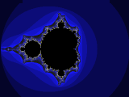
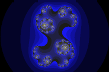
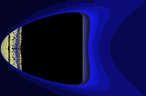
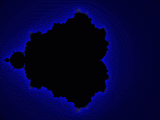
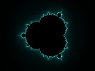

# Gnofract 4D

## Installation

### Installation on Linux

#### General instructions & dependencies

First step is to compile the program by running:

```
./setup.py build
```

Then you can install it with:

```
./setup.py install
```

Or you can just run Gnofract 4D on your local directory with:

```
./gnofract4d
```

To compile, you will need Python 3.5 or higher, a C++ compiler such as g++, and header files for GTK3 and Python. Headers for Jpeglib and libpng are optional, but highly recommended - without them you can only use the extremely basic TGA file format.

At runtime, you will need PyGTK 3, and a C compiler (because that gets invoked to compile the fractal formula you have written).

Alternatively, you can download the [lastest version](https://github.com/fract4d/gnofract4d/releases) of the program and install it with `pip` running:

```
pip3 install gnofract4d-4.3.tar.gz
```

When the installation ends just run it by clicking on the desktop icon or typing:

```
gnofract4d
```

#### Install on Ubuntu 15.04

Before running `./setup.py build` you have to install `python-dev`.

Either find it in synaptic, or run `sudo apt-get install python-dev` from the command line.

#### Install on Ubuntu 16.04 and later supported releases

You can install pre-build packages from this [PPA](https://launchpad.net/~renbag/+archive/ubuntu/gnofract4d) following the instructions given there.

## Introduction

> There is no excellent beauty which hath not some strangeness in the
> proportion.  -- _Francis Bacon_

Gnofract 4D is a program which draws complex mathematical
objects known as fractals, including the Mandelbrot and Julia sets and
many others. It allows you to treat a fractal which has more than one
parameter as a four-dimensional object and interactively view slices
of this object from arbitrary angles, giving rise to some very unusual
images.

This user's manual provides a tutorial introduction to Gnofract 4D and the
mathematical background behind it, information on how to use the
graphical interface, and reference material on the language used to
write fractal formulas.

### Using Gnofract 4D

Gnofract 4D's screen layout is deliberately simple. Most of the screen is
taken up by a view of the fractal you're investigating. By
default, this is the Mandelbrot set. You can directly click on this to
zoom. The toolbar provides quick access to frequently used functions,
and more complex properties of the fractal are accessed through dialog
boxes brought up via the menu bar.

Initially, just play around - after all, generating fractals isn't
meant to be _work_. If you make a change you don't
like, just hit Undo.


### Interacting with the Fractal

Each fractal is an infinitely complex image, which you can see a slice
of in the main window. By left-clicking on the window, you can zoom in
to view finer and finer details. Just click on an area you like to
view it more closely. If you click and drag with the left button, you can
draw a white box around an area. When you let go, you zoom in
so that the area inside that box fills the window. 

To zoom back out, click with the right button. You can also press
**Home** to return all parameters to the starting point
for this fractal, **Control+Home** to
reset the zoom only, or use **Undo** to go back one
step.  There isn't a click and drag feature for the right button.

Clicking with the middle button rotates the view by 90 degrees in the
_xz_ and _yw_ axes. If you're
currently looking at the Mandelbrot set, you'll get a Julia set, and
vice versa. If you're looking at something else, you'll get something
weird. Note that clicking this twice doesn't take you back to where
you started: the screen also gets recentered on the point you clicked,
so middle-clicking twice will normally give you a perturbed, deformed-looking
Mandelbrot.

The cursor keys pan around the image. Hold down
**Control+<cursor>** to move more
quickly. Hold down **Shift** +
**<cursor>** to move around in the other two
dimensions, mutating the image. You can recenter the image on a point
by left-clicking on that point while holding down
**Shift**. 

> **Non-4D formulas.**
Some fractal formulas
(typically those originally written for Fractint or UltraFractal)
don't support full 4D operation. (Gnofract 4D determines this by whether
the formula uses the **#zwpixel** variable.) In this
case, the widgets for rotating in other dimensions, warping, and the
middle mouse button will be disabled.  


### Working with Files

Gnofract 4D uses several different types of file. These have different
purposes as listed in the table below.

File Type | Extensions | Description
--- | --- | --- 
Parameter File | `.fct` | A parameter file is a small text file which contains all the settings required to produce a particular image, such as the position of the viewer along the X axis and the coloring scheme used. The parameter file lists the formula used, but doesn't contain the entire formula, so if you invent a new formula and want to share parameter files which use it, you need to distribute the formula file as well. **Fractint** uses `.par` files for this purpose and UltraFractal uses `.upr`. Unfortunately Gnofract 4D can't read those formats (yet).
Image File | `.tga`, `.jpg`,`.png`| Gnofract 4D supports TARGA, JPEG and PNG file formats for image output. _No information about the fractal parameters is stored in the image file_, so if you want to carry on exploring from a particular point you need to save a parameter file as well. Gnofract 4D can't load image files, only save them. Choose **File** > **Save Image** to save an image. I recommend using PNG images for high quality output, and JPEGs only when image size is important, because JPEGs introduce artifacts which blur the fine details of your fractal.
Formula File | `.frm`, `.ufm` | A formula file is a collection of formulas, each of which is a description of the algorithm used to draw a particular kind of fractal, expressed in a simple programming language (see [Formula Language Reference](#formula-language-reference) for language details). Both Gnofract 4D and Fractint use `.frm` as the extension, and UltraFractal uses `.ufm`. In general, any formula which works in Fractint should work in Gnofract 4D and any which works in Gnofract 4D should work in UltraFractal, but the reverse is not true. 
Coloring Algorithm File | `.cfrm`, `.ucl` | A coloring algorithm file is a collection of formulas used to assign colors to a fractal. Gnofract 4D combines a coloring algorithm with a formula to produce the final image (this approach is shared with UltraFractal - Fractint restricts you to built-in coloring algorithms).  Coloring algorithms are written in the same language as fractal formulas. UltraFractal uses the extension .ucl for its coloring algorithm files. Some of these are compatible with Gnofract 4D but so far not very many.
Gradient File | `.map`, `.ggr`, `.ugr`, `.cs`, `.ase` | A gradient file is a list of colors which is used to translate the purely numerical output of the formula into something pretty to look at. Gradients are currently saved only inside the fractal itself, not as separate files. The GIMP uses the extension `.ggr` for its gradient files; Fractint uses `.map` for its own, simpler files. UltraFractal uses `.ugr` - these files contain multiple gradients. Several programs including Adobe ones and https://coolors.co/ support ASE (Adobe Swatch Exchange).


## Tools

### Autozoom

**Autozoom** automatically searches for interesting parts of the
fractal by zooming in repeatedly, each time choosing the quadrant of
the screen which has the largest number of different colors (with some
randomization as well). You can start it going, go off for a coffee,
and see what it's found when you return, or guide it by clicking on
parts you like as it goes. It'll stop when the image reaches the
minimum size, which is set by default to stop just before you get to
the limits of the precision Gnofract 4D offers.


### Explorer

The **Explorer** helps you find neat-looking fractals
easily. It divides the screen into a large central section and smaller
"subfractals" which surround it. The central section is the main image
- you can click on this to zoom in, change the color, or perform any
operation you can normally. The other images around the edges are
"mutant" versions of the main image - they're formed by starting with
the base parameters and randomly changing them a bit. Whenever you
change the main image, you get a whole new set of mutants. If you like
a mutant more than the main picture, click on it to move it to the
middle - it then becomes the main picture and you get 12 new mutants
based on the new main image. When you're satisfied with the results,
click the Explorer button again to return to normal mode.  

The Shape and Color sliders on the toolbar determines how
different the mutants are from the standard image. If Shape's set to
100, they're almost unrecognizable - if it's 0, they're exactly the
same. Similarly if Color's 100, each mutant is a different color, and
0 keeps the colors all the same.  

### Formula Browser

The **Formula Browser** allows you to look at all the
fractal formulas, coloring functions and gradients which are currently loaded formula files. When you select a formula (from the Formula list in the middle), the source window shows you the contents of that formula. You can then use **Apply** to change the current fractal to use that formula. This also resets the formula's parameters to their defaults. Alternatively, **OK** applies the formula and closes the window.  


Tips: 
- To load a new formula file, choose **File** > **Open Formula File**. 

- If you have changed a formula on disk after using it, choose **Refresh** to have Gnofract 4D re-read it.

- If the formula contains errors, **Apply** and **OK** will be
disabled. Check the Messages window to see what the errors
are. 

### Director

The **Director** allows you to create fractal videos.
You first define keyframes which are points in the video.
Then, for each of them, you specify how long a still image of the keyframe will
stay in the video (**stopped for**), how long the transition
is to the next keyframe (**transition duration** - in frames)
and the interpolation type used for the transition from several possibilities.
When you hit **Render** button, Director will render all
frames and put them in the directory you selected and then it will create
the video using [FFmpeg](https://www.ffmpeg.org/).


Tips:

- In order to end up with a video file, not just a bunch of images, you need to have **ffmpeg** compiled with support for zlib and libvpx.

- You can always save your animation configuration for later use.

- You can always stop rendering images. As long as you use same animation setting again (for example, saving them before starting rendering), Director will start from where it stopped last time.

### Randomize Colors

Replaces the current gradient with a randomly-generated new one.

### Painter

The **painter** dialog allows you to change the colors of your fractal by
clicking on the place where you want the color to be different. First,
select the color you want in the color selector. Then click on the
image - the part of the gradient most responsible for the color of
that pixel will be updated with the color you chose. Toggle the
"painting" button off if you want to interact with the fractal while
the painter dialog is up.

## Toolbar buttons

On the left of the toolbar you can see a small preview window, which
updates as you change the angle or position buttons, to give you an
idea of what the fractal will look like when you release the button.


The first eight toolbar buttons correspond to the ten parameters which
define the view. The circular angle buttons, labelled
**xy** to **zw**, correspond to
rotation around the principal planes in four dimensions. They can
be changed by dragging the dot around. When you let go, the fractal will
update. By the way, the **zw** angle does work, you
just can't see its effects until you rotate in some other dimensions
first.  

The square position buttons, **pan** and
**wrp** (aka Warp), can be used to alter the view. The
**pan** button allows you to pan around the current
view. The **wrp** button allows you to move along the
other two axes, resulting in a mutated version of the current image.
Click inside one then drag the mouse, watching the preview window
update, then release the mouse when you like the results.  

The warp menu allows even formulas which weren't designed to be
used with Gnofract 4D to be used in 4D mode. If the current fractal has any complex parameters, they're listed in this menu. If you select one,
that parameter's value is set to the value of the Z and W coordinates
for each pixel. Basically what this means is that the parameter you choose
becomes the fourth dimension. NB: If you set an explicit value for the parameter as well, it'll be ignored.

The **Deepen** button allows you to increase the current iteration count
and tighten the periodicity checking, for those occasions when the
auto-deepening and/or auto-tolerance doesn't get it right. This will
generally convert some 'inside' pixels to outside and make the image
look better, at the cost of longer rendering time. The image size list should be
self-explanatory. If you want a size not listed here, use the
Preferences dialog.   The **Undo** and
**Redo** buttons should be fairly obvious. You can
undo as many times as you like. Note that undo also affects parameters
such as color, not just position on screen.  Lastly, the
**Explore** button toggles Explorer Mode. See [Explorer](#explorer).

## Changing Fractal Settings

 In Gnofract 4D, settings are divided into **Fractal
Settings**, **Gradients** and
**Preferences**. **Fractal Settings** and **Gradients** are saved in the
fractal's .fct file - they are properties of the fractal itself. By
contrast, **Preferences** are your preferences for
Gnofract 4D's general behavior and are saved in Gnofract 4D's config file
(~/.gnofract4d), so they will still be active next time you
start Gnofract 4D.

### Fractal Settings

The **Formula** section allows you to choose the
formula used to calculate the fractal, and to set any parameters the
formula has. You can modify the formula by choosing **Browse**, which invokes the Formula Browser. **Max Iterations** sets the number of iterations a point will go through before we give up and assume it's a member of the Julibrot. The other parameters on this pane are different depending on the fractal type.

The **Outer** tab controls the function used to
decide what color to draw those points which aren't part of the
fractal set proper. Similarly, the **Inner** page
controls the function used for points which are part of the set.

The **Location** entryboxes allow you to
change the coordinates of the screen center and the image size. 

The **Angles** entryboxes allows you to set the rotation
angles. Only values between 0 and 2 * pi are different; values outside
this range "wrap" to points inside that range.

The **Transforms** page allows you to control a list
of transformations applied to the image, and any parameters those transforms have.

The **General** page gives a few options which don't
fit anywhere else. **Flip Y Axis** causes Y to
increase top-to-bottom, rather than
bottom-to-top. **Periodicity Checking** is a method
to speed up generation of the fractal. Points inside the fractal
eventually settle into a loop, where they repeatedly jump around
between the same points (they become 'periodic'). By noticing this, we
can skip calculating the point any further. You will generally want to
disable this if you are coloring the inside of the fractal, since it
will look rather weird otherwise. **Tolerance** is
the distance between points which we'll accept as being 'the same' for
the purposes of periodicity detection. This is automatically adjusted
if the 'auto tolerance' setting in the preferences is enabled.

The **Colors** tab allows you to edit the list of
colors used to display your fractal. For more complex gradient
editing, you can also use the GIMP's gradient editor.

It is also possible to use the online palette editor tool at https://coolors.co/ 
to modify the palette. You can start editing the current palette in Coolors 
by clicking **Edit Gradient Online** in the Colors tab. When you are done editing, in the Coolors UI
choose **Export** > **Copy URL**. Then paste into the Gnofract 4D window. This
changes the current gradient to the one you edited online.

### Preferences

#### Image

 **Width** and **Height** set
the size of the image in pixels. If **Maintain Aspect Ratio** is checked when you change either the width or
height, the other automatically changes to keep the image the same
shape. If **Auto Deepen** is enabled, Gnofract 4D will try
to automatically guess how many iterations are required to display the
image correctly. Similarly, **Auto Tolerance**
adjusts the periodicity tolerance setting to try and calculate the
image quickly but correctly. **Antialiasing** makes
the image look smoother but takes extra time to do. The difference
between 'fast' and 'best' is that fast antialiasing doesn't bother to
recalculate points which are the same color as their neighbors. This
speeds things up a lot but can miss a few details sometimes. 

#### Compiler

Gnofract 4D needs a C compiler to be available at runtime in order to work
(it dynamically creates the code to compute a particular formula when
you select it). The **Compiler** page allows you to
specify a location for the compiler and options to pass to
it. _If Gnofract 4D is working fine, generally I suggest you leave
those settings alone_. However you **may** be able to
get noticeable performance gains by specifying the specific kind of
processor you have. For example, some AMD processors will
benefit by adding "-mathlon -msse2 -m3dnow" to the compiler flags.

The **Formula Search Path** lists the directories where Gnofract 4D will look for formulas when a parameter file is loaded.
 
#### General

**Number of threads** sets how many calculation
threads to use. Generally, leave this at 1 unless you have a
hyper-threaded or multi-processor computer, in which case set it to 1
greater than the number of cores you have.
 
#### Helpers

Gnofract 4D sometimes need to invoke a helper program. If the default is
wrong you can designate a different program here.
 
## Hints

- If you zoom into a busy part of the fractal the image can look
"noisy". You can fix this by making the colors change more slowly - go
to the "Outer" tab and change the transfer function to 'sqrt' or 'log' - or change "Density" to a number between 0 and 1 - a density of 0.1
makes the colors change 10 times more slowly.

- If you have an Inner coloring method other than zero, you may
see weird effects unless you disable periodicity checking.

- If the image looks pixelated, you've zoomed in as far as we can go.

## Command Reference



## About the math

<aside class="notice">Warning: Dubious mathematics ahead!
I'm not a mathematician. You may find this discussion
insultingly oversimplified or just plain wrong.
</aside>

### The Mandelbrot Set

The Mandelbrot may be
defined as the set of all complex numbers which, when you
repeatedly square them and add them again, never become infinite. (The
official definition of the set is somewhat different: it is the set of
points in the complex plane whose corresponding Julia sets are
connected. These end up being the same thing.)

We can tell that a number will eventually reach infinity if it ever
gets outside a circle of radius 2 around the origin. Unfortunately, we
can't tell in general that a point will **never**
become infinite, so we have to estimate by trying a large number of
times before giving up.

In Gnofract 4D, the formula is:


```
Mandelbrot1 {
init:
    z = 0
loop:
    z = z^2 + c
bailout:
    |z| < 4.0
}
```


(`|z|` means the square of the magnitude of `z`). We calculate the loop
function repeatedly until the bailout condition is false or we've
performed the maximum number of iterations. At that point, if we
"bailed out", we know we're outside the set: otherwise we're
(probably) inside.


We do this repeatedly for each position on the screen, setting
`c` to a different value for each point. This gives
rise to the familiar Mandelbrot set:




All the points inside the set are (as is traditional) coloured
black. The points outside the set are different colours depending on
how long it takes them to escape from the set. These colours aren't
very mathematically significant, but they look nice.

So what happens if `z` is initially set to a
complex value other than zero? (Strictly speaking, you shouldn't do
this. Zero is important because it is the **critical
value** of `z^2+c` - other values are not mathematically
meaningful. However, as with most fractal programs, Gnofract 4D allows you
to draw anything which looks interesting, regardless of its
mathematical purity.)

Well, you get a rather odd-looking, deformed M-set.  This initial
value, which we'll call `z0`, is called the intial
perturbation, and sets which have a non-zero `z0`
are known as **perturbed** sets: 


```
Mandelbrot2 {
init:
    z = z0
loop:
    z = z^2 + c
bailout:
    |z| < 4.0
}
```


 ### The Julia Set

The Julia set is actually drawn by the same procedure as the
Mandelbrot set. But instead of changing the value of
`c` for each pixel, we keep `c`
constant and change `z0`. There is a different
Julia set for each value of `c`; here's the one for `c` = 0.

```
BoringJulia {
init:
    z = z0
loop:
    z = z^2 + 0
bailout:
    |z| < 4.0
}
```


Boring, isn't it? That's because we're just squaring the value at each
iteration without adding anything to it. So any value which starts
with a magnitude less than 1 will shrink forever (and hence is a
member of the set). All other values will grow forever, and so we've
just discovered a rather inefficient way of drawing perfect circles.
If we use a different value of **c** we get something more
interesting: 



### The Julibrot

Here we come to the heart of the matter. I said above that both the
Julia and Mandelbrot sets are drawn with the **same
function**. 

```
Julibrot(z0,c) {
init:
    z = z0
loop:
    z = z^2 + c
bailout:
    |z| < 4.0
}
```

The Julibrot function has two complex parameters, or four real
ones. In Gnofract 4D I refer to the real parameters as x, y, z, and w:
these are c.re , c.im, z0.re and z0.im respectively.

The only difference is which points we choose to draw. To draw the
Mandelbrot set, we keep `z0` constant and change
`c` with each pixel. To draw the Julia set, we keep
`c` constant and change `z0`. If
you squint with your brain a bit, you can imagine both sets as
orthogonal "slices" through the same four-dimensional object. In
Gnofract 4D terms, the Mandelbrot set is the `xy`
plane, and the Julia set is the `zw` plane. We can
also look at other planes: here's an image of the
`xw` plane:




### Viewing in Four Dimensions

However, we can draw any 2D slice we like, not just those which are
parallel to the Julibrot axes. To do this we'll need to describe our
scene by four things. First, the (`x,y,z,w`)
coordinates of the center of the screen. Second, a vector for the
x-axis of the screen. This tells us how to change the parameters to
the Julibrot function as we proceed across the screen. Third, a vector
for the y-axis. Fourth and finally, the size of the image. For the
Mandelbrot set, our "default" view, the screen is centered at
[0,0,0,0], the x-vector is [1,0,0,0] and the y-vector is
[0,1,0,0]. The initial size is 4, because the whole Mandelbrot set
fits inside the 2x2 square. We can zoom into the set by changing
`x` and `y` and the zoom factor.


If we want to draw other slices, we need to rotate our view through
four dimensions. In 3D, we can rotate in 3 directions: around the
`x`, `y`, and `z` axes. In 4D, we rotate around a **plane** rather than a line, and we can rotate in 6
directions: around the `xy, xz, xw, yz, yw` and `zw` planes. For example, if we rotate through 90
degrees in the `xz` and `yw` directions, our screen vectors become
[0,0,1,0] and [0,0,0,1]: in other words, the Julia set. If we rotate
only part of the way, we get a "hybrid" between the two sets, which
looks decidedly odd:



In fact, we can rotate to any angle in each of the planes,
creating a whole world of bizarre pictures.

### Hypercomplex Fractals and Quaternions

 There are other kinds of fractal which are commonly described
as "four-dimensional" - hypercomplex and quaternion-based
fractals. Hypercomplex numbers have four components (one real and
three imaginary) where complex numbers have two. Since the
hypercomplex mandelbrot has two hypercomplex parameters, in Gnofract 4D
terms it's actually an eight-dimensional object. Gnofract 4D allows you to
set four of these as part of the view - the other four have to be set
via parameters. Gnofract 4D doesn't support quaternions at present.

## Writing Your Own Functions

When you get tired of the fractal functions which come with Gnofract
4D, you can write your own, or take advantage of thousands of formulas
written by other fractal enthusiasts. Gnofract4D can load most fractal
formula files written for Fractint (and some written for
UltraFractal). However the compiler is not 100%
backwards-compatible with Fractint, so unfortunately some fractals
can't be loaded, or will display differently when they do. Gnofract 4D
also supports many constructs Fractint doesn't, so you need to take
extra care when writing formulas if you want them to work in Fractint
too.

Here are links to some online resources for formula files:

- [Gnofract 4D Formula Repository](https://github.com/fract4d/formulas)

A collection of about 25,000 Fractint formula files by many authors,
originally compiled by George C. Martin and currently maintained by
Paul N. Lee. Indispensable. </listitem>

- [UltraFractal public formula database](http://formulas.ultrafractal.com/)
Many thousands of formulas by users of
UltraFractal. Some of the coloring algorithms and forumlas will work with Gnofract 4D. 
Please report issues, since I aim to improve compatibility further in future
releases. 

### Writing Your First Formula

This section steps you through the creation of a new fractal
formula. By the way, the formulas for each of these steps can also be
found in the file `formulas/tutorial.frm`.

1. Using a text editor, Create a new file called `example.frm` (the
extension is important - Gnofract 4D uses this to decide whether the file
is a formula or a coloring function).

1. Enter the following in `example.frm`.
```
MyFormula1 {
; First example formula - this produces a variant on the Mandelbrot set
init:
    z = 0
    c = #pixel
loop:
    z = z*z*c + c*c
bailout:
    |z| < 4.0
}
```

3. Start Gnofract 4D, choose **File | Open Formula
File**, and open example.frm. You should see MyFormula in
the list of formulas to choose from. Select it and click Apply. You
should see an image like this:



4.  A few things to note about the formula. It's divided into named
sections, marked with a colon: "init", "loop". and "bailout". The
compiler uses these to supply some of the standard scaffolding for a
fractal function so you don't have to. The "loop" statement is the
heart of the formula - this is the statement which is run repeatedly
and which defines the shape of your fractal.

5. At this point, the widgets for rotating the image in 4D will be
disabled, because your formula doesn't use any of the 4D
options. Let's turn those on. Edit your formula so it reads:

```
MyFormula2 {
; Second example - introduce 4D
init:
    z = #zwpixel ; take initial value from 4D position
    c = #pixel
loop:
    z = z*z*c + c*c
bailout:
    |z| < 4.0
}
```

6. Then hit **Refresh** on the Formula Browser window. You 
should now find that all the options are enabled. This is because the image now depends on all 4 components of the 4D space, via #pixel and #zwpixel.

7. Next let's add some parameters to our function:

```
MyFormula3 {
; Third example - add a parameter
init:
    z = #zwpixel
    c = #pixel
loop:
    z = @myfunc(z*z*c) + @factor * z + c*c
bailout:
    |z| < 4
default:
param factor
	default = (1.0,0.5)
endparam
}
```

8. Hit **Refresh** again, then **Edit > Fractal Settings** to show the formula settings. You
should two extra parameters in addition to the standard "Max
Iterations" option: **myfunc**, with a drop-down list
of functions, and **fac** (or Factor) with a
draggable 4-way widget and 2 edit boxes. If you set myfunc to
**sqr** and set factor to (-1,0.5) you should see:


 
9. Parameters like this are a quick way to add more options to your
fractal. Listing them in the "default" section is optional but
provides a way to pre-populate your formula with values that work
well. If you leave the default out Gnofract 4D will use "ident" for
functions and 0 for numeric ones.

## Formula Language Reference



## Gnofract 4D Internals

This section explains how Gnofract 4D is structured. You don't need to know
any of this to use the program, but it may come in handy if you want
to change it or contribute to its development (which you're heartily
encouraged to do!).

Gnofract 4D is implemented primarily in Python, with some C++
extensions. Extensive use
is made of Python unittest framework to keep everything working - each
Python file `foo.py` is accompanied by
`tests/test_foo.py`, which contains unit tests for that
file's features. 'test.py' for each folder runs all of the tests.

### Source Code Layout

The important directories in the source are:

Directory | Contents
--- | ---
`fract4d` | This contains all the non-GUI-related, relatively platform-independent parts of the code. This is in case it ever needs to be ported to another environment (eg run on a server without a GUI as part of a cluster). The main class which represents a fractal is in `fractal.py`. This holds references to the compiled code, the formula and colorfunc definitions, the parameters and the colormap. It also handles loading and saving information from a `.fct` file, and provides wrappers for some of the gnarlier C++ extension functions. 
`fract4d_compiler` | This contains all the files of the compiler (see below). The main class is `fc.py`
`fract4d/c` | This contains the C++ extension code which is compiled to produce `fract4dc.so`. This is divided into a set of classes which communicate primaily via interfaces. The main responsibility of this code is to call the 'pointFunc' (the function which calculates a single pixel) once for each point on the image. This code also does the bulk of the '4D' manipulation -`vectors.h` contains code for 4-vectors and 4x4 matrix math. This library also handles multi-threaded calculations, parcelling out the work to multiple MTFractWorkers via the queue in `threadpool.h` 
`fract4dgui` | This contains the python code which implements the GUI. It uses PyGTK3 as the GUI toolkit. Basically there's one class per dialog or custom control, and a few other for utility purposes. The central class is `gtkfractal`, which wraps a `fractal` and displays the results of the calculation in a window. 

### Compiler

The most complicated part of Gnofract 4D is the compiler. This takes
as input an UltraFractal or Fractint formula file, and produces C
code. We then invoke a C compiler (eg gcc) to produce a shared library
containing code to generate the fractal which we dynamically load.

The UltraFractal manual is the best current description of the formula
file format, though there are some UltraFractal features which are not
yet supported. You can download it from https://www.ultrafractal.com/download/uf6-manual.pdf

The implementation is based on the outline in "Modern Compiler Implementation in ML: basic
techniques" (Appel 1997, Cambridge). It doesn't do any
optimization at this point, leaving that to the C compiler used as a
back-end. It would be worthwhile to do some simple optimization (eg
constant-folding, removing multiplication by 1.0) because the C
compiler refuses to do this to floating point numbers.

Overall structure: The [PLY](http://www.dabeaz.com/ply/ply.html) package
is used to do lexing and SLR parsing - it's in
`lex.py` and
`yacc.py`. `fractlexer.py` and
`fractparser.py` are the lexer and parser
definitions, respectively. They produce as output an abstract syntax
tree (defined in the `Absyn` module). The
`Translate` module type-checks the code,
maintains the symbol table (`symbol.py`) and
converts it into an intermediate form (`ir.py`).
`Canon` performs several simplifying passes on
the IR to make it easier to deal with, then
`codegen` converts it into a linear sequence of
simple C instructions. `stdlib.py` contains the
'standard library' of mathematical functions, like cosh(z). It's at
this point that complex and hypercomplex variables are expanded out
into pairs of floating point numbers - the C code is oblivious to the
complex numbers. Finally we invoke the C compiler to convert to a
native code shared library.


At runtime the different phases happen at different times. First, the
entire .frm file is lexed and parsed. Then when a particular formula
is selected, it's translated and syntax-checked. The actual code is
only generated just before the fractal is drawn. This phase is
repeated whenever the function parameters are changed (eg @fn1 is set
to 'cosh').

Probably the ugliest part of the code is the handling of
parameters. Numeric parameters like floats are passed in as an array,
and the C++ code and Python code need to collaborate to work out which
indices into this array correspond to which params- this is done by
sorting them into alphabetic order. In general this area is a bit of a
mess.

### Threading

One of the weirder parts of the code is how we deal with
threading. Basically we want the calculation of the fractal to happen
on a different thread (or multiple threads for SMP) from the main UI,
so you can interrupt at any point. This is complicated by the fact
that Python only allows a single thread in the Global Interpreter
Lock, and that PyGTK is often compiled by Linux distribution vendors
without thread support, meaning this lock is not released when running
the GTK main loop. (This last is probably nottrue any more, but I haven't checked.)

The way out of this is that the additional threads live only in the
C++ code, where they are invisible to the Python code and GTK. When
`pycalc` is called with asynchronous=True, it spawns a
thread to do the calculation, which may in turn spawn more workers if
we want multiple threads. These all write to the image buffer and
report back what they're doing by writing messages into a pipe. This
pipe is added to the list of things the GTK main loop monitors, so
whenever a new message appears we get a callback into the gtkfractal
code, interleaved with the normal GTK events. We can interrupt a
calculation in progress by setting a var which the calculation threads
check frequently - they then abandon their work and quit.  

> Warning: Multiple threads and C++ exceptions do not coexist
well on some libstdc++'s. Gnofract 4D was originally written not to use exceptions 
as a result. This may no longer be an issue but I haven't tried it.

## FAQs

**When I zoom in a long way, the picture gets all blocky - is that a bug?**

Not exactly. This means that you have reached the limit of the precision offered by the math chip on your PC - the area you are looking at is now so small that differences between adjacent pixels are too small for the processor to deal with. Some fractal programs support arbitrary precision math, which increases this limit, but this isn't implemented in Gnofract 4D yet.

**What is this I saw on the web about a security vulnerability? It sounds scary!**

There was a bug in Gnofract4d 2.0 and 2.1 where if you downloaded a parameter (.fct) file someone sent you, they could have snuck some evil code in it and Gnofract 4D would run that code. I actually found the bug and fixed it in version 2.2, but a security company "helpfully" decided to publish an inaccurate advisory claiming that it affected all versions. So if you use 2.0 or 2.1, upgrade. Otherwise, don't worry about it.

## Bugs and Known Issues

Please report any bugs you encounter, via <ulink>https://github.com/fract4d/gnofract4d/issues</ulink>

## About Gnofract 4D

This is Gnofract 4D version . You can find the most recent version of
Gnofract 4D from https://github.com/edyoung/gnofract4d

## Credits and copyright

Gnofract 4D is Copyright 1999-2020 Edwin Young
[edwin@bathysphere.org](mailto:edwin@bathysphere.org)
, and is distributed under the **BSD
license**.  See the file "LICENSE" for details. 

Gnofract 4D was originally based on a program called Gnofract, written by Aurelien Alleaume
though none of the original code remains in the current version.
Gnofract could once be obtained from http://www.multimania.com/mason
but this no longer appears to work. 

**Branko Kokanovic** developed and contributed the animation feature. 
**Chris Le Sueur** provided parts of the gradient editing feature. 
**Henryk Trappmann** provided HSV gradient support. 
The man page was contributed by **Aleksander Adamowski**.
**Rachel Mant** maintained the project for several years and provided many useful updates.
**Chris Mayo** modernized a lot of code and made the Python 3 update possible.
**Alberto Gonzalez** and **Guanchor Ojeda Hernández** have refactored and improved the code considerably.

The formula language which Gnofract 4D uses originated in Fractint and
was substantially enhanced in UltraFractal. However the compiler
implementation does not share any code with those programs.

The Gnofract 4D distribution contains palette (.map) files by a number of
authors which were originally distributed with 
[Fractint](https://fractint.org/) under somewhat murky
licensing conditions. It also contains a copy of "standard.ucl",
originally distributed with [UltraFractal](https://www.ultrafractal.com), by kind
permission of Frederik Slijkerman, Damien Jones, and Kerry Mitchell.
`blatte1.ugr` and `blatte2.ugr` are included by kind permission of 
['Blatte'](http://exoteric.roach.org/). The formulas
in Sterling2.frm are translations of formulas originally created by
Tad Boniecki for use with the SterlingWare 2 fractal program.

`lex.py` and `yacc.py` come from
the PLY package, and are distributed under the BSD license.

Some of the menu icons are taken or adapted from
the <ulink url="http://tango.freedesktop.org">Tango icon set</ulink>.
